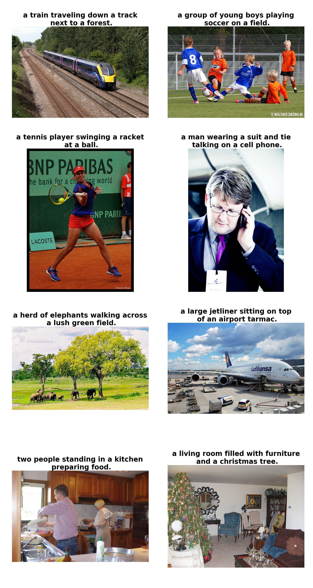

### Introduction
This neural system for image captioning is roughly based on the paper "Show, Attend and Tell: Neural Image Caption Generation with Visual Attention" by Xu et al. (ICML2015). The input is an image, and the output is a sentence describing the content of the image. It uses a convolutional neural network to extract visual features from the image, and uses a LSTM recurrent neural network to decode these features into a sentence. A soft attention mechanism is incorporated to improve the quality of the caption. This project is implemented using the Tensorflow library, and allows end-to-end training of both CNN and RNN parts.

### Prerequisites
* **Tensorflow** ([instructions](https://www.tensorflow.org/install/))
* **NumPy** ([instructions](https://scipy.org/install.html))
* **OpenCV** ([instructions](https://pypi.python.org/pypi/opencv-python))
* **Natural Language Toolkit (NLTK)** ([instructions](http://www.nltk.org/install.html))
* **Pandas** ([instructions](https://scipy.org/install.html))
* **Matplotlib** ([instructions](https://scipy.org/install.html))
* **tqdm** ([instructions](https://pypi.python.org/pypi/tqdm))

### Usage
* **Preparation:** Download the COCO train2014 and val2014 data [here](http://cocodataset.org/#download). Put the COCO train2014 images in the folder `train/images`, and put the file `captions_train2014.json` in the folder `train`. Similarly, put the COCO val2014 images in the folder `val/images`, and put the file `captions_val2014.json` in the folder `val`. Furthermore, download the pretrained VGG16 net [here](https://app.box.com/s/idt5khauxsamcg3y69jz13w6sc6122ph) or ResNet50 net [here](https://app.box.com/s/17vthb1zl0zeh340m4gaw0luuf2vscne) if you want to use it to initialize the CNN part.

* **Training:**
To train a model using the COCO train2014 data, first setup various parameters in the file `config.py` and then run a command like this:
```shell
python main.py --phase=train \
    --load_cnn \
    --cnn_model_file='./vgg16_no_fc.npy'\
    [--train_cnn]    
```
Turn on `--train_cnn` if you want to jointly train the CNN and RNN parts. Otherwise, only the RNN part is trained. The checkpoints will be saved in the folder `models`. If you want to resume the training from a checkpoint, run a command like this:
```shell
python main.py --phase=train \
    --load \
    --model_file='./models/xxxxxx.npy'\
    [--train_cnn]
```
To monitor the progress of training, run the following command:
```shell
tensorboard --logdir='./summary/'
```

* **Evaluation:**
To evaluate a trained model using the COCO val2014 data, run a command like this:
```shell
python main.py --phase=eval \
    --model_file='./models/xxxxxx.npy' \
    --beam_size=3
```
The result will be shown in stdout. Furthermore, the generated captions will be saved in the file `val/results.json`.

* **Inference:**
You can use the trained model to generate captions for any JPEG images! Put such images in the folder `test/images`, and run a command like this:
```shell
python main.py --phase=test \
    --model_file='./models/xxxxxx.npy' \
    --beam_size=3
```
The generated captions will be saved in the folder `test/results`.

### Results
A pretrained model with default configuration can be downloaded [here](https://app.box.com/s/xuigzzaqfbpnf76t295h109ey9po5t8p). This model was trained solely on the COCO train2014 data. It achieves the following BLEU scores on the COCO val2014 data (with `beam size=3`):
* **BLEU-1 = 70.3%**
* **BLEU-2 = 53.6%**
* **BLEU-3 = 39.8%**
* **BLEU-4 = 29.5%**

Here are some captions generated by this model:


### References
* [Show, Attend and Tell: Neural Image Caption Generation with Visual Attention](https://arxiv.org/abs/1502.03044). Kelvin Xu, Jimmy Ba, Ryan Kiros, Kyunghyun Cho, Aaron Courville, Ruslan Salakhutdinov, Richard Zemel, Yoshua Bengio. ICML 2015.
* [The original implementation in Theano](https://github.com/kelvinxu/arctic-captions)
* [An earlier implementation in Tensorflow](https://github.com/jazzsaxmafia/show_attend_and_tell.tensorflow)
* [Microsoft COCO dataset](http://mscoco.org/)


================================================================================================================================
#### 以上为原作者的Readme
# 项目使用过程中发现在python3上运行会出各种各样的bug,故修改了部分源码
- 首先test的环境依赖文件在requirements_lib下的test_requirements.txt中,部分whl文件也在其中
- 你需要安装这些依赖
- 如果你用了virtualenvwrapper/virtualenv,那么你在建立属于本项目的虚拟环境时,最好加上参数--system-site-packages
- 将输入的图片放在image_captioning/test/images/下
- 切到image_captioning(即项目根目录)下,运行以下命令
```shell
python main.py --phase=test \
    --model_file=./models/289999.npy \
    --beam_size=3
```
所用模型是原作者在COCO2014训练集上训练好的289999.npy,由于github有单个文件必须小于100MB的限制,所以289999.npy请到我的云盘下载,链接为:
链接：https://pan.baidu.com/s/1j1t9uUbteRTXtbE0pI543Q 
提取码：5xuc 

